最近在做一个「从零实现 [Coze Studio](https://github.com/coze-dev/coze-studio)」的项目。不是抄代码，而是**把它的领域模型、表结构和模块边界吃透之后，自己再实现一遍**——这是吃透一个优秀开源项目最扎实的路径。

这篇文章是这个系列的总纲：先把原项目分析清楚（架构、技术栈、55 张表），再把整个实现拆成**准备阶段 + 11 个实施阶段**。每个阶段开始前，都先用 Mermaid 把该阶段涉及的表结构和依赖关系画出来，先分析、再动手。

> 路径约定：下文所有路径均相对于仓库根目录，分析基于当前[开源版本](https://github.com/coze-dev/coze-studio)，表结构以 `docker/volumes/mysql/schema.sql` 为准（共 55 张表）。

## 第 0 阶段（准备）：项目全景与开发环境

动手写第一行代码之前，先把地图看全。这个阶段不产出功能，产出的是**对全局的判断**。

### 0.1 仓库全景

Coze Studio 是字节开源的一站式 AI Agent 开发平台（可视化编排智能体 / 应用 / 工作流）。仓库顶层结构：

```text
coze-studio/
├── backend/          # Go 后端（主体）
│   ├── api/          #   HTTP 层：handler / router / middleware / model
│   ├── application/  #   应用服务层（按模块编排领域对象）
│   ├── domain/       #   领域层：17 个领域模块（核心）
│   ├── crossdomain/  #   跨领域依赖的接口定义（16 个）
│   ├── infra/        #   基础设施：orm、rdb、cache、storage、embedding、es、eventbus...
│   ├── conf/         #   配置：模型元数据、提示词模板、插件产物...
│   └── types/ pkg/   #   公共类型与工具
├── frontend/         # React + TypeScript 前端（monorepo）
├── idl/              # Thrift IDL：API 契约的「唯一事实来源」
├── docker/           # 部署：docker-compose + atlas 数据库迁移 + 卷挂载
└── helm/             # K8s 部署
```

后端是标准的 **DDD 分层**，以 `domain/user` 为例，每个领域都是同一套骨架：

```text
domain/user/
├── entity/            # 实体定义（User、Space、Session）
├── service/           # 领域服务（业务逻辑）
├── repository/        # 仓储接口（面向接口编程）
└── internal/dal/      # 数据访问层（GORM Gen 生成的 model/query）
```

依赖方向严格单向：`api → application → domain → crossdomain/infra`，领域层不感知 HTTP 和存储细节。这里可以参考 [**开发规范**](https://github.com/coze-dev/coze-studio/wiki/7.-%E5%BC%80%E5%8F%91%E8%A7%84%E8%8C%83#%E9%A1%B9%E7%9B%AE%E6%9E%B6%E6%9E%84)

### 0.2 技术栈清单

| <div style="width: 120px;">层次</div> | 选型                                                      | 说明                                                      |
| ------------------------------------- | --------------------------------------------------------- | --------------------------------------------------------- |
| 语言/框架                             | Go ≥ 1.23 + [Hertz](https://github.com/cloudwego/hertz)   | CloudWeGo HTTP 框架                                       |
| LLM 编排                              | [Eino](https://github.com/cloudwego/eino) + eino-ext      | 字节开源的 LLM 应用编排框架，是 Agent/Workflow 引擎的底座 |
| 模型接入                              | ark / openai / claude / deepseek / gemini / qwen / ollama | eino-ext 组件，可插拔                                     |
| ORM                                   | GORM + Gen                                                | 代码生成的类型安全查询                                    |
| 关系存储                              | MySQL                                                     | 55 张业务表                                               |
| 缓存/会话                             | Redis                                                     | 会话缓存、分布式锁、计数                                  |
| 向量检索                              | Milvus（可切 OceanBase）                                  | 知识库语义检索                                            |
| 全文检索                              | Elasticsearch                                             | 知识库关键词检索                                          |
| 对象存储                              | MinIO（S3 协议）                                          | 文件、图片、知识库文档                                    |
| 消息队列                              | NSQ（可切 RocketMQ/Kafka）                                | 事件总线：异步索引、异步任务                              |
| 配置/注册                             | etcd + 本地 conf + 环境变量                               | 单体部署下 etcd 可省略                                    |
| 前端                                  | React + TypeScript + Rush monorepo                        | 可视化编排界面                                            |

### 0.3 基础设施与部署

`docker/docker-compose.yml` 一键拉起全部依赖：

| 服务                         | 镜像职责                                               | 是否必须                                              |
| ---------------------------- | ------------------------------------------------------ | ----------------------------------------------------- |
| mysql                        | 业务主库，启动时执行 `docker/volumes/mysql/schema.sql` | 必须（可使用pg代替）                                  |
| redis                        | 缓存 / 分布式锁 / 会话                                 | 必须                                                  |
| minio                        | 对象存储（S3）                                         | 可暂时本地存储                                        |
| milvus                       | 向量检索                                               | 知识库阶段引入（可先用 pg 过渡）                      |
| elasticsearch                | 全文检索                                               | 知识库阶段引入（可先用 pg 过渡）                      |
| nsqlookupd / nsqd / nsqadmin | 事件总线                                               | 异步任务阶段引入（可用 goroutine + 数据库状态机过渡） |
| etcd                         | 配置与注册中心                                         | 单体可省略                                            |
| coze-server / coze-web       | 后端镜像 / 前端镜像                                    | 完整实现后从源码自构建                                |

### 0.4 配置体系

`backend/conf/` 是理解这个项目的钥匙，很多「功能」其实先是一份配置：

| 目录                         | 作用                                           | 关键文件                                                                                               |
| ---------------------------- | ---------------------------------------------- | ------------------------------------------------------------------------------------------------------ |
| `conf/model/`                | **模型服务配置**：启动时把 JSON 种子灌入数据库 | `model_meta.json`（provider→models 声明）+ `template/*.yaml`（每类协议的参数模板）                     |
| `conf/prompt/`               | 提示词模板（Jinja2）                           | `nl2sql_template_jinja2.json`（数据库 NL2SQL）、`messages_to_query_template_jinja2.json`（Query 改写） |
| `conf/workflow/`             | 工作流引擎配置                                 | `config.yaml`                                                                                          |
| `conf/plugin/pluginproduct/` | 官方内置插件产物                               | 每个插件一份 YAML（manifest + openapi 描述）                                                           |
| 环境变量                     | 数据库/中间件地址、模型密钥                    | `docker/.env`（compose 引用），OpenAI/方舟 API Key 在此配置                                            |

### 0.5 全量表清单（55 张）

按领域模块分组（这是后续所有阶段的地基，建议对照着读）：

| <div style="width: 100px;">模块</div> | 数据表                                                                                                                                                                                                                              |
| ------------------------------------- | ----------------------------------------------------------------------------------------------------------------------------------------------------------------------------------------------------------------------------------- |
| 用户/空间                             | `user`、`space`、`space_user`、`api_key`                                                                                                                                                                                            |
| 模型                                  | `model_meta`、`model_entity`、`model_instance`                                                                                                                                                                                      |
| 会话/执行                             | `conversation`、`message`、`run_record`                                                                                                                                                                                             |
| 智能体                                | `single_agent_draft`、`single_agent_version`、`single_agent_publish`、`agent_tool_draft`、`agent_tool_version`、`prompt_resource`、`shortcut_command`、`chat_flow_role_config`                                                      |
| 插件                                  | `plugin`、`plugin_draft`、`plugin_version`、`tool`、`tool_draft`、`tool_version`、`plugin_oauth_auth`                                                                                                                               |
| 知识库                                | `knowledge`、`knowledge_document`、`knowledge_document_slice`、`knowledge_document_review`                                                                                                                                          |
| 数据库表                              | `draft_database_info`、`online_database_info`、`agent_to_database`                                                                                                                                                                  |
| 工作流                                | `workflow_meta`、`workflow_draft`、`workflow_version`、`workflow_snapshot`、`workflow_reference`、`workflow_execution`、`node_execution`                                                                                            |
| 应用/发布                             | `app_draft`、`app_release_record`、`app_connector_release_ref`、`app_static_conversation_draft/online`、`app_dynamic_conversation_draft/online`、`app_conversation_template_draft/online`、`template`、`connector_workflow_version` |
| 记忆/变量                             | `variables_meta`、`variable_instance`                                                                                                                                                                                               |
| 基础                                  | `files`、`kv_entries`、`data_copy_task`                                                                                                                                                                                             |

### 0.6 贯穿全局的五个设计模式

读表之前先记住这五个反复出现的模式，后面每个阶段都在用：

1. **三态发布模型**：几乎所有资源都是 `xxx_draft`（草稿）→ `xxx_version`（版本快照）→ `xxx_publish`（发布记录）三张表。编辑永远改草稿，发布时冻结成版本，线上跑的是版本。这是整个系统的灵魂，阶段 4 会展开。
2. **JSON 弱引用聚合**：智能体对插件、知识库、工作流的引用，存的是 JSON 数组（id + 配置快照），而不是强外键。换来的是跨模块解耦，代价是要自己做一致性校验。
3. **雪花 ID**：全系统不用数据库自增（个别表除外），统一分布式 ID 生成（`infra/idgen`），bigint 主键。
4. **毫秒时间戳 + 软删除**：`created_at/updated_at` 全部是毫秒级 bigint，删除基本都是 `deleted_at` 软删。
5. **空间隔离**：所有资源都挂 `space_id`，空间即资源边界，权限检查（`domain/permission`）以空间为第一维度。

### 0.7 开发环境准备

自建项目的推荐环境：

```bash
# 1. 基础环境
Go >= 1.23、Node >= 20、Docker + Compose v2

# 2. 拉起基础设施（先注释掉 coze-server/coze-web，只要中间件）
cd docker && docker compose up -d mysql redis minio

# 3. 初始化数据库：schema.sql 就是我们的建表参考
mysql -h127.0.0.1 -uroot -p123456 < docker/volumes/mysql/schema.sql

# 4. 模型密钥（二选一即可）
#    火山方舟 ARK_API_KEY 或 OPENAI_API_KEY，后续阶段 2 接入

# 5. 建议的工程骨架（对照原版裁剪）
mini-coze/
├── api/            # handler + router + middleware
├── application/    # 应用服务
├── domain/         # 领域模块（与本文阶段一一对应）
├── crossdomain/    # 跨领域接口
├── infra/          # orm/cache/storage/embedding...
└── conf/           # 配置
```

### 0.8 实现路线图


依赖关系上有两点说明：阶段 4（智能体）在原版里是对插件/知识库/工作流的**JSON 弱引用**，所以它可以先做骨架、后接资源；阶段 6/7/8 之间相互独立，可以按兴趣调整顺序。

---

## 第 1 阶段：用户与空间

### 表结构分析

一切资源都挂在「空间」下，一切空间操作都由「人」发起。这个阶段四张表：

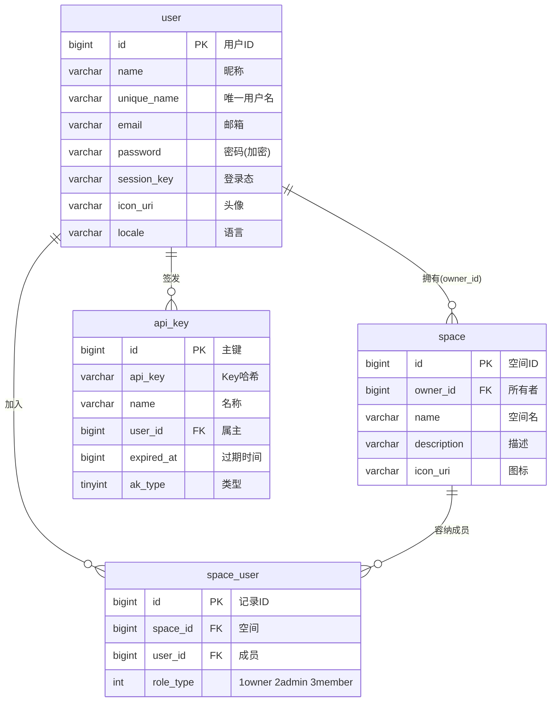

### 要点解读

- **`user.session_key`**：Coze 用「会话密钥」而非纯 JWT——登录后生成随机 session_key 存表（配合 Redis 缓存），后续请求带 cookie/token 反查。自建时用 JWT 也行，但要保留登出能力的话，session 表/缓存更省事。
- **`space_user.role_type`**：空间内 RBAC 就三级：owner / admin / member。所有后续资源接口的鉴权第一问都是「这个 user 在这个 space 里是什么角色」。
- **`api_key`**：给 OpenAPI 用的个人密钥，库里只存哈希，`last_used_at` 顺便做审计。类型字段 `ak_type` 区分个人密钥与 PAT。
- ID 生成：从这里开始就用雪花 ID（参考 `infra/idgen`），别用自增，后面分库分表、数据迁移都靠它。

### 本阶段交付

注册/登录/登出、用户信息 CRUD、空间 CRUD、空间成员管理（邀请/改角色/移除）、空间级鉴权中间件。这是所有后续阶段的验收基座——**任何一个新资源接口，都要能回答「操作者在哪个空间、什么角色」**。

---

## 第 2 阶段：模型服务

没有模型接入，后面全是空谈。Coze 的模型管理分「静态配置种子」和「数据库三层模型」两部分。

### 表结构分析

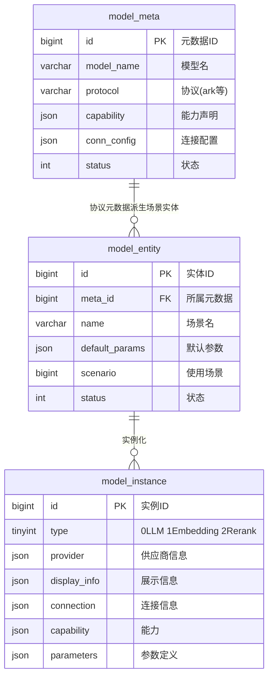

### 要点解读

- **为什么分三层**：`model_meta` 是「协议级」元数据（如方舟协议的 doubao-pro），`model_entity` 是「场景级」实体（同一个模型在不同场景给不同默认参数），`model_instance` 是「运行级」实例（Embedding/Rerank/LLM 统一抽象，全 JSON 字段）。自建简化版可以砍成两层：模型定义 + 场景配置。
- **种子灌入**：启动时读 `conf/model/model_meta.json`（结构是 provider → model → capability/parameters），把官方适配的模型清单写入数据库；`template/*.yaml` 定义每类协议有哪些可调参数（temperature、top_p 的范围、精度、文案）。
- **与 Eino 的桥接**：每个 `protocol` 对应一个 eino-ext 适配器（`components/model/ark|openai|claude|deepseek|gemini|qwen|ollama`）。运行时按模型的 protocol + conn_config 实例化对应的 Eino `ChatModel`，全系统其他模块只面向 Eino 的统一接口。
- 自建建议：先只接一种协议（OpenAI 兼容），把「按配置实例化模型」的工厂函数写稳，再多协议扩展。

### 本阶段交付

模型列表管理接口（增删改查/启停）、模型参数模板、`ChatModel` / `Embedding` 工厂。验收标准：改数据库里的连接配置，不改代码，切换模型供应商。

---

## 第 3 阶段：对话与会话

从这一阶段开始出现「运行时」概念：会话承载消息，执行记录承载一次对话的全过程。

### 表结构分析

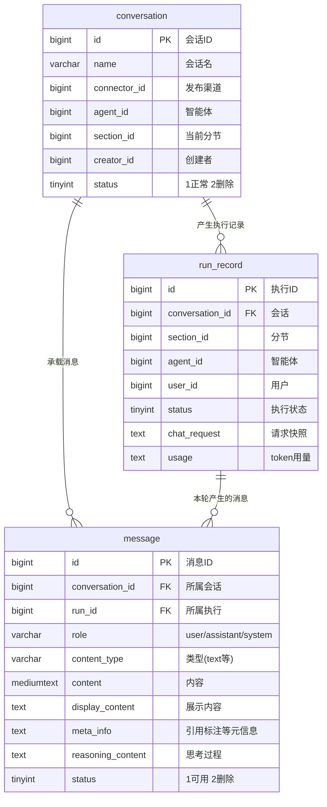

### 要点解读

- **`section_id`（分节）**：一个会话内部按「上下文窗口」切分节，每节内部连续对话。超长后滚动新分节，旧分节作为历史归档。表上没有独立 section 表，它是 `conversation` 与 `message` 上的逻辑字段——自建时先按「一个会话一个 section」实现，留出字段即可。
- **`message` 的字段设计很有讲究**：`content`（给模型的原文）、`display_content`（给用户看的渲染文本）、`model_content`（中间过程）、`reasoning_content`（思维链）、`meta_info`（引用了哪些知识切片/插件结果）。一层 UI 一层模型，别混存。
- **`run_record`**：一次对话执行的全记录——请求快照、状态机、失败原因、token 用量。它是计费、审计、排障的根。流式 SSE 里每个事件都挂在一个 run 上。
- 流式协议：Coze 走 SSE（`infra/sse` + hertz-contrib/sse），事件流大致是 `message → message tick → done`。自建时先做同步接口，再升级 SSE，接口设计要一开始就按「事件流」建模。

### 本阶段交付

会话 CRUD、发消息（同步 + SSE）、消息历史分页、run 状态查询。验收标准：拿阶段 2 的模型工厂，能对一个裸模型跑通多轮对话并把消息完整落库。

---

## 第 4 阶段：智能体（Agent）

项目的核心阶段。这里会第一次完整出现「三态发布模型」，后面所有可发布资源都是它的变体。

### 表结构分析

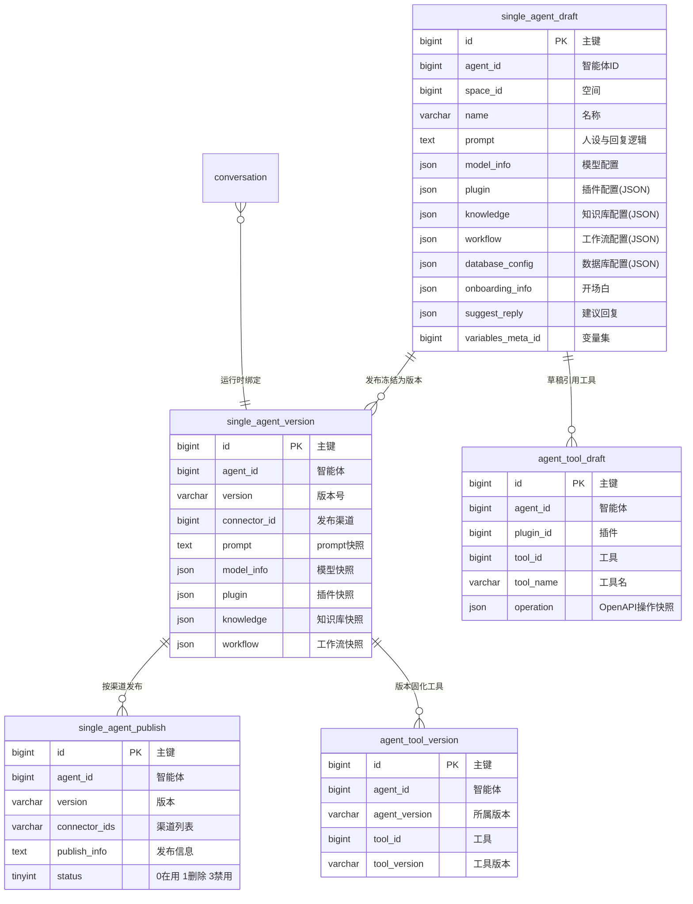

### 要点解读

- **三态模型，吃透它**：
  - `draft`：唯一可编辑态。编排页读写它。
  - `version`：发布时把 draft 全量快照 + 分配版本号（时间戳序列）。不可变。
  - `publish`：某版本在某渠道（connector）上的发布记录。
  - 运行时（对话）只认 version，不认 draft。**调试走 draft 的临时运行，正式走 version**。
- **JSON 弱引用**：`plugin/knowledge/workflow/database_config` 存的是「资源 ID + 该资源的配置」。好处是智能体模块不依赖插件/知识库模块的表结构；代价是发布时要校验引用有效性、删除资源时要检查引用方。原版用 `crossdomain` 接口做这个校验。
- **`agent_tool_draft` 为什么单独建表**：工具引用需要存储 OpenAPI operation 快照和方法/子路径，方便运行时零回查调用；发布时复制进 `agent_tool_version` 与 agent 版本对齐。
- **运行时装配（Eino）**：对话请求进来 → 取 agent version → 反序列化各 JSON 配置 → 用阶段 2 的工厂实例化模型 → 组装 Eino 的 Agent（prompt、Tools、Retriever、Workflow 作为节点）→ 执行 → 消息落库（阶段 3）。这个装配函数是整个平台的心脏。
- `prompt_resource`（提示词库）和 `shortcut_command`（快捷指令）是这个阶段的伴生资源：前者是空间级的 prompt 片段库，后者是绑定到智能体的 `/命令` 快捷操作。

### 本阶段交付

智能体 CRUD、草稿编辑、发布（生成版本快照 + 发布记录）、基于 version 的对话运行时。验收标准：一个只配了 prompt + 模型的智能体，发布后能通过 API 正常对话。

---

## 第 5 阶段：插件与工具

插件 = 一个 OpenAPI 服务；工具 = 插件里的一个 operation。这也是一套三态模型，且比智能体的更完整。

### 表结构分析

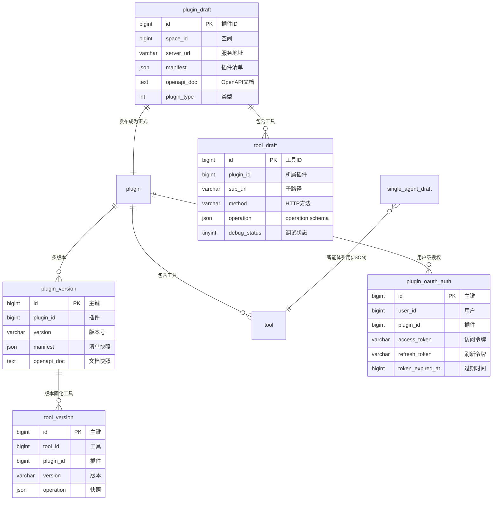

### 要点解读

- **OpenAPI 是契约**：插件创建时提交 manifest（元信息）+ OpenAPI 文档（kin-openapi 解析校验），每个 operation 解析成一个工具：`sub_url + method + operation schema`（参数、返回值、描述全在 schema 里）。LLM 选工具时读的就是这段 schema，写得清不清楚直接决定 Agent 会不会用。
- **三态在此处最严格**：`plugin_draft/tool_draft` 随便改（有 `debug_status` 调试标记）→ 调试通过 → 发布生成 `plugin`、`tool` 正式行 + `plugin_version/tool_version` 快照。智能体引用的是正式工具，发布智能体时把工具版本一并固化（阶段 4 的 `agent_tool_version`）。
- **执行链路**：运行时工具调用 = 按 operation 构造 HTTP 请求 → 注入鉴权（`plugin_oauth_auth` 里的用户级 token，支持授权码 OAuth 的刷新）→ 解析响应 → 回填给模型。错误处理和超时控制在这里做，别散在 Agent 层。
- 官方内置插件来自 `conf/plugin/pluginproduct/*.yaml`，启动时导入——自建时照此机制先送几个内置插件（如时间、天气）方便调试。

### 本阶段交付

插件创建/导入/调试/发布、工具列表与参数 schema 管理、工具运行时执行器、用户级 OAuth 授权。验收标准：智能体绑定一个 HTTP 工具后，对话中模型能自主发起真实调用并引用结果。

---

## 第 6 阶段：知识库（RAG）

四张 MySQL 表 + 两个外部检索引擎（Milvus 向量 / ES 全文），MySQL 只管「资产」，检索靠专用引擎。

### 表结构分析

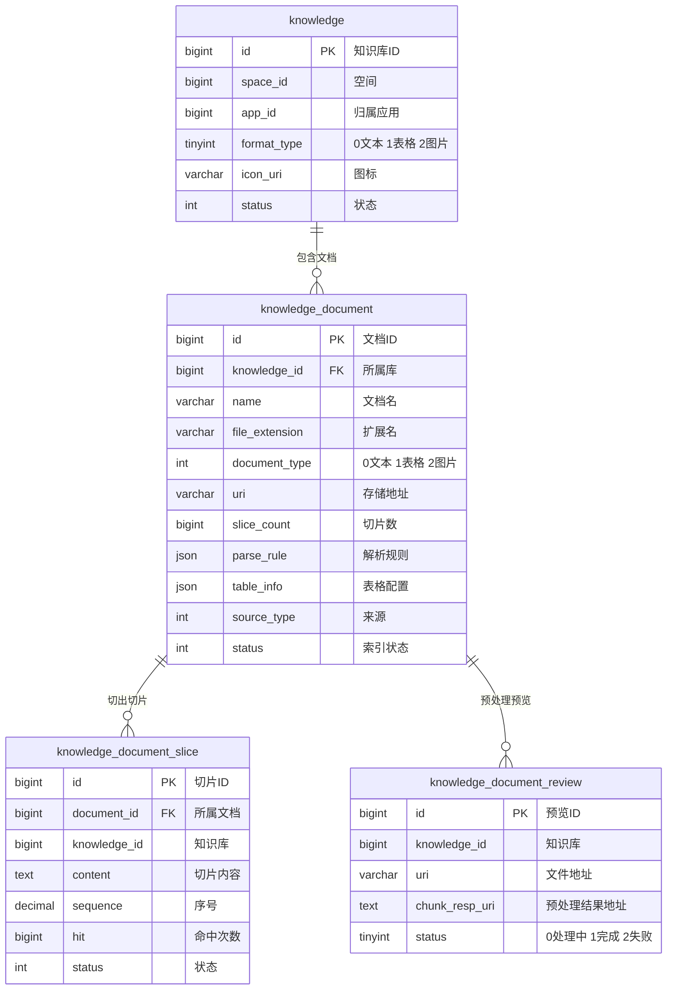

### 要点解读

- **异步流水线**：上传文档 → `knowledge_document_review` 预览（解析 + 预切片，状态机：处理中/完成/失败）→ 用户确认切分规则 → 正式入库：文档下载 → 解析（文本/表格/图片三套解析器，`infra/document`）→ 切片写入 `knowledge_document_slice` → 向量化写入 Milvus、关键词写入 ES 索引 → 文档状态置为可用。NSQ 事件总线驱动每一步。
- **`parse_rule` / `table_info`**：JSON 存每个文档的自定义切分配置（分隔符、chunk 大小、重叠）；表格知识库还要存列 schema，检索时走表格问答链路。
- **检索层抽象**：定义 `Retriever` 接口（Eino 有现成组件），实现「向量检索（Milvus）+ 全文检索（ES）+ 多路召回融合」；`infra/embedding` 用阶段 2 的 Embedding 模型实例。检索结果带 `slice_id`，回表拿原文并给引用标注（阶段 3 的 `meta_info`）。
- **自建过渡方案**：初期可以只做向量检索（Milvus 单 collection，按 knowledge_id 过滤），ES 后补；切片内容也可以先只存 MySQL，量大了再外置。

### 本阶段交付

知识库 CRUD、文档上传/解析/切片流水线、向量与全文双路检索、智能体绑定知识库后的引用式回答。验收标准：上传一篇文档，对话中提问能命中切片并给出引用标注。

---

## 第 7 阶段：数据库表（Agent Database）

这是容易被忽略的功能：让智能体挂一张结构化表，用自然语言查询/写入。它有自己的三态模型 + 动态物理表。

### 表结构分析

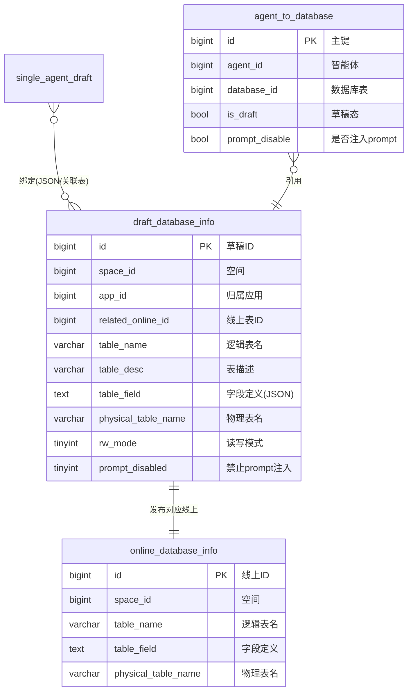

### 要点解读

- **元数据表 + 动态物理表**：`table_field` 存字段定义（名字/类型/描述/枚举），真正存数据的是按 `physical_table_name` **动态 CREATE TABLE** 出来的 MySQL 物理表。发布草稿时：校验 schema → 建物理表 → 写 `online_database_info`。
- **NL2SQL**：查询请求 → 把表结构 + 字段描述注入模板（`conf/prompt/nl2sql_template_jinja2.json`）→ 模型生成 SQL → `infra/sqlparser` 做语法与安全校验（只读模式拦写语句）→ 执行 → 结果回填给模型。`rw_mode` 的三档（受限读写/只读/完全读写）就是在这里生效的。
- **`agent_to_database`**：智能体与表的绑定关系单独建表（带 `is_draft`），因为运行时要把表结构注入 prompt，比 JSON 快照更需要一致性管理。
- 自建警示：动态建表 + 拼 SQL 是安全重灾区，SQL 校验器（白名单语句类型、表名限定、LIMIT 强制）必须先于功能上线。

### 本阶段交付

数据库表资源 CRUD + 发布、动态物理表管理、智能体绑定、NL2SQL 查询链路。验收标准：建一张「客户表」，对话中问「最近 5 条客户」能返回真实数据。

---

## 第 8 阶段：工作流

最复杂的单体模块：可视化编排 + 版本快照 + 执行引擎 + 执行追踪，四组概念七张表。

### 表结构分析

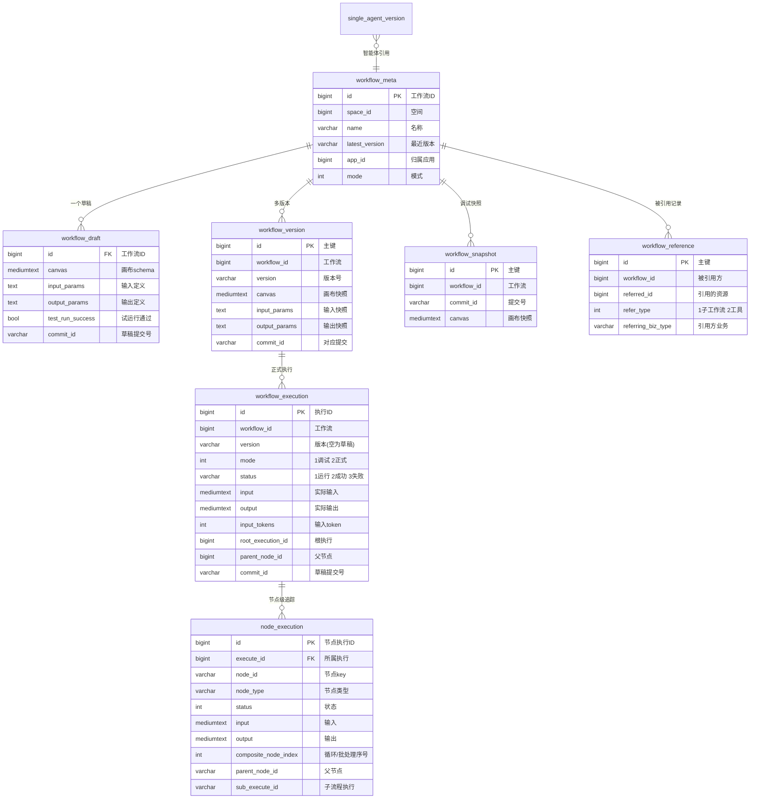

### 要点解读

- **meta / draft / version 与前文一致**，多出两个概念：
  - **`commit_id` + `workflow_snapshot`**：草稿每次保存/试运行生成 commit 快照（类似 git），执行记录反查 commit_id 就能精确复现当时画布——调试执行回放的关键。
  - **`workflow_reference`**：显式的引用关系表（子工作流/被当工具用），支撑引用检查与级联发布。
- **执行模型**：`workflow_execution`（一次运行）→ `node_execution`（每个节点一条）。`root_execution_id / parent_node_id / sub_execute_id` 三个字段支撑子工作流嵌套与循环节点（`composite_node_index` 记循环轮次）。
- **引擎选型**：原版基于 Eino 的 compose（Graph/Chain 编排）+ `infra/checkpoint`（可恢复执行，`resume_event_id` 支持中断恢复）。自建建议先实现线性 + 分支的 DAG 解释器，节点类型从 LLM / 代码 / HTTP / 知识检索四种起步，异步中断恢复放后期。
- **Chatflow**：`chat_flow_role_config` 是「对话流」的人设配置（开场白、建议回复、用户输入配置、语音配置），本质是对话型工作流的 Agent 皮——做完整流编排时顺手支持。

### 本阶段交付

画布 schema 定义与 CRUD、草稿 commit/试运行、发布版本、DAG 执行引擎 + 节点级追踪、子工作流引用。验收标准：编排「LLM → 知识检索 → LLM」三节点流，试运行、发布、对话中作为智能体的工作流能力被调用，全程执行轨迹可查。

---

## 第 9 阶段：应用与发布

应用（App）是资源的容器与面向渠道发布的单元。这个阶段表的「数量」上来了，但模式全部是前文的复用。

### 表结构分析

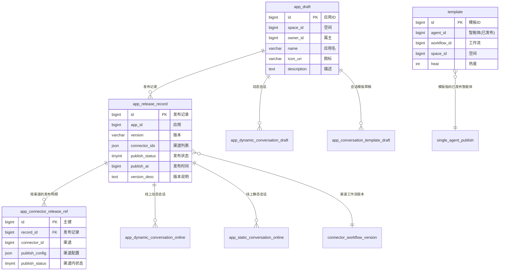

### 要点解读

- **connector（渠道）**：发布的目标端（API 渠道、Chat SDK、Web 预览等）。一次应用发布 = 一条 `app_release_record` + 每个渠道一条 `app_connector_release_ref`（渠道级配置与状态）。阶段 3 的 `conversation.connector_id` 就是它。
- **会话模板/动态会话**：应用可以把一组预置会话「打包」——静态模板（`app_static_conversation_*` 挂模板）与动态会话（`app_dynamic_conversation_*` 挂运行会话），草稿/线上成对出现，发布时复制。这是「应用开箱自带示例对话」的底座。
- **`template`**：模板市场——把已发布的智能体/工作流收录为模板（带热度），用户「用模板创建」= 复制资源到自己的空间（顺理成章引出阶段 11 的 `data_copy_task`）。
- 发布是**跨模块事务**：冻结应用内所有资源版本（智能体、工作流各自的 version 表）→ 写发布记录 → 处理 `connector_workflow_version` 等关联。自建时建议用「先写发布记录、状态机推进、失败可重试」的最终一致方案，别硬上分布式事务。

### 本阶段交付

应用 CRUD、发布流水线（多渠道）、会话模板、模板收录与复制。验收标准：把一个带智能体 + 工作流的应用发布到 API 渠道，用阶段 3 的 OpenAPI 按应用维度发起对话。

---

## 第 10 阶段：记忆与变量

Agent 的「状态」分两层：结构化变量（可读写）与对话记忆（上下文管理）。

### 表结构分析

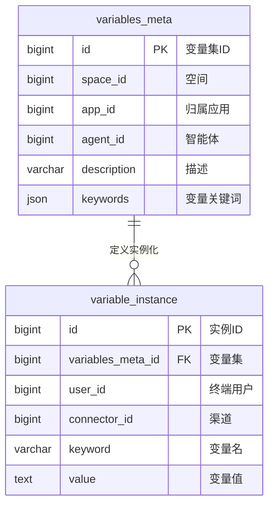

### 要点解读

- **`variables_meta`**：变量集定义（挂在智能体或应用上），`keywords` 声明变量名与提取关键词。
- **`variable_instance`**：按「终端用户 × 渠道」维度存值——同一个变量，不同用户在不同渠道各有各的值。这是 Agent 记住「这个人」的机制。
- **对话记忆**：短期记忆 = 阶段 3 的会话/分节上下文窗口管理；长期记忆走知识库链路（自动把对话要点写入记忆库，用阶段 6 的检索召回）。原版 `domain/memory` 就是把两者编排起来。
- 自建建议：先只做变量表（实现简单、收益立竿见影——记住用户称呼/偏好），长期记忆等知识库稳定后再接。

### 本阶段交付

变量集定义、变量读写 API、对话运行时的变量注入与回写。

---

## 第 11 阶段：周边能力补全

最后收尾的独立模块，每个都不大，但完整感来自它们。

### 表结构分析

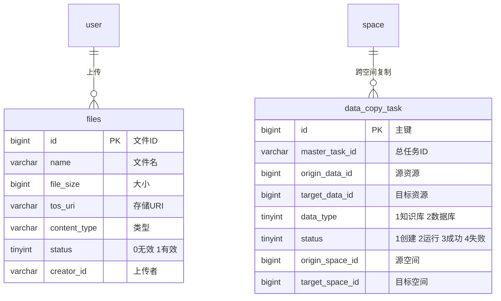

### 要点解读

- **`files` + MinIO**：统一上传中心。所有 icon_uri / 文档 uri 背后都是这条记录 + MinIO 对象（`infra/storage`，S3 协议，生产可换 TOS/OSS）。注意 `creator_id` 是 varchar——历史上兼容过多种 ID 形态，自建统一 bigint 即可。
- **`data_copy_task`**：模板复制/跨空间迁移的异步任务表（状态机：创建→运行→成功/失败），按资源类型逐条记录。配合阶段 9 的模板市场。
- **无表模块**：联网搜索（`domain/search`，接搜索服务的 API）、OpenAPI 鉴权（`api/middleware/openapi_auth.go`，校验阶段 1 的 api_key）、权限中心（`domain/permission`，空间角色 + 资源级判断）、passport 登录态。这些以代码为主，不需要新表。
- **kv_entries**：通用 KV 兜底表（namespace + key），小配置、状态标记的集散地，别滥用。

---

## 结语：实现顺序与验收清单

回顾整个拆解，依赖链是清晰的：

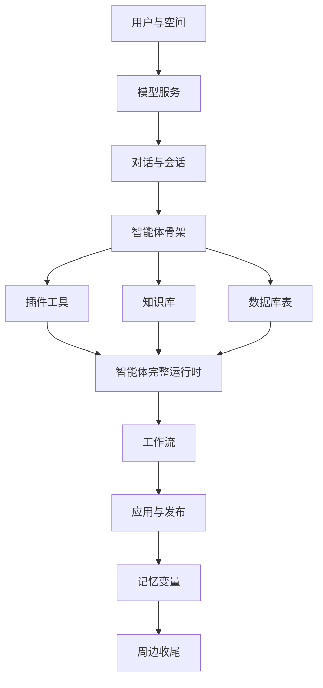

给自建者的三条心法，也是我从这份源码里读出的最重要的经验：

1. **表结构先行**：每个阶段先把表和索引设计对齐原版，代码只是表结构的表达。原版 55 张表里几乎每张的索引都能看出它的核心查询路径。
2. **三态发布模型是骨架**：智能体、插件、工具、工作流、应用、数据库表——把 draft → version → publish 做成可复用的模式（甚至公共代码），后面每个模块都是填空。
3. **运行时只认版本**：对话永远跑 version 快照，调试才碰 draft。守住这条，编排类产品的稳定性就有底线。

各阶段都可以独立成篇展开（尤其工作流引擎和 RAG 流水线），后续我会挑实现中最有坑的部分继续写。

