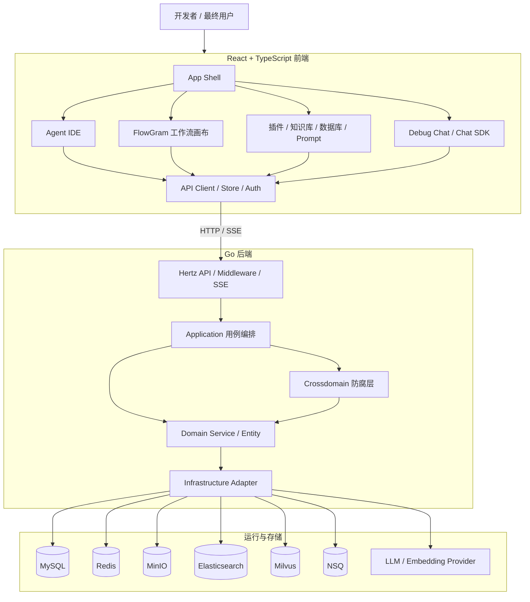
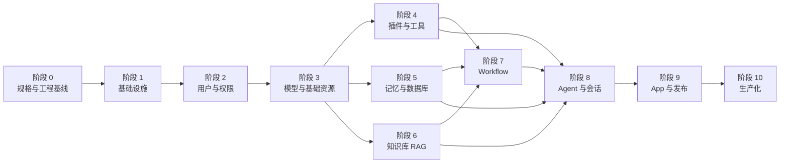
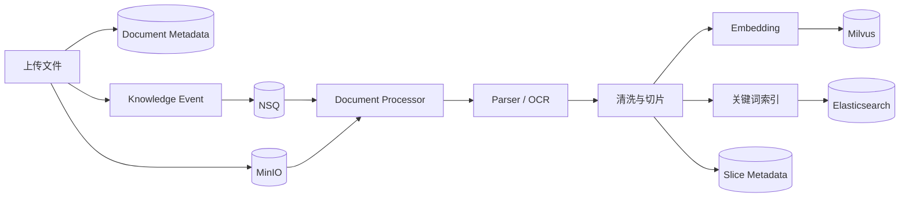
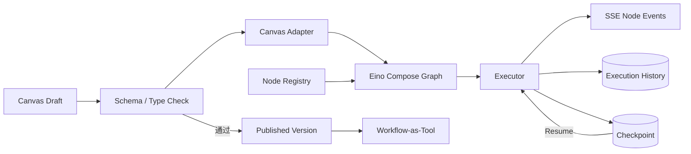
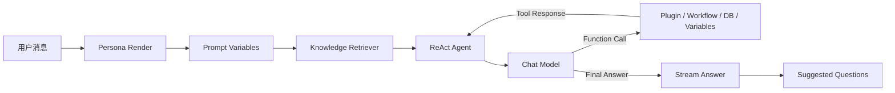
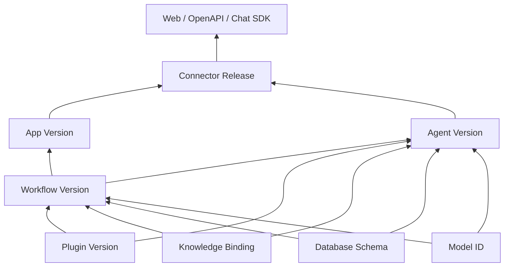

## 前言

Coze Studio 并不只是一个套着聊天界面的 LLM 应用。

从产品上看，它同时包含 Agent IDE、工作流编辑器、知识库、插件、数据库、模型管理、调试会话和发布系统；从工程上看，它又涉及配置态与运行态分离、草稿与版本管理、异步文档处理、流式事件、跨领域调用和多种基础设施。

如果一开始就从页面入手，很容易做出一个“看起来像 Coze”的系统，却无法支撑真实运行。更合理的做法是先理解原项目的领域边界，再按照依赖方向逐层实现。

本文以 [Coze Studio 官方仓库](https://github.com/coze-dev/coze-studio) 为蓝本，基线固定为提交 `fefb05ff27be1da939612fbf9faf5db62583b8ae`。目标不是逐文件翻译源码，而是保留原项目最重要的产品能力、领域模型、运行链路与架构思想，给出一条从零开始、每个阶段都能验收的开发路线。


本文适合准备实现 AI Agent 开发平台、可视化工作流系统或企业级 RAG 平台的开发者。你不需要预先读完整个 Coze Studio 源码，但最好具备 Go、React、关系型数据库和基本 LLM API 的使用经验。


## 一、我们最终要实现什么

完整的目标系统应该具备以下能力：

- 管理并调用不同厂商的大语言模型和 Embedding 模型。
- 创建、编辑、调试、发布和管理 Agent。
- 为 Agent 装配 Prompt、插件、工作流、知识库、数据库和变量。
- 通过可视化画布创建、运行和发布 Workflow。
- 导入 OpenAPI，将外部 HTTP API 转换为模型可调用的 Tool。
- 上传并解析文档，完成切片、向量化、检索和重排。
- 管理 Conversation、Message 和 Agent Run，并通过 SSE 流式返回运行事件。
- 将 Agent 或 App 发布到连接器、OpenAPI 和 Chat SDK。
- 支持用户、空间、权限、资源复制、统一搜索和生产运维。

这些能力并不是并列的。Workflow 依赖 Plugin、Knowledge、Database 和 Model；Agent 又依赖 Workflow 以及这些基础资源；Conversation 则负责驱动 Agent 运行并保存消息。因此，开发顺序必须服从依赖关系。

## 二、先理解 Coze Studio 的整体架构

### 2.1 系统组件关系



### 2.2 后端的 DDD 分层

原项目后端主要采用以下目录结构：

```text
backend/
├── api/           # Handler、Middleware、API Model、Router
├── application/   # 用例编排、服务装配、事务边界
├── crossdomain/   # 跨领域接口和防腐层
├── domain/        # Entity、Domain Service、Repository Interface
├── infra/         # DB、Cache、MQ、Storage、Search 等具体实现
├── bizpkg/        # 与业务相关的可复用能力
├── pkg/           # 通用基础工具
├── types/         # 常量、错误码和 DDL
└── conf/          # 模型及基础组件配置
```

各层的依赖方向应该保持单向：

```text
API → Application → Domain → Repository Interface
                    ↓
               Crossdomain

Infrastructure ──实现──> Repository Interface
```

这里最重要的规则不是目录叫什么，而是业务规则不能散落在 Handler、数据库 DAO 或第三方 SDK 中。

- API 层只负责协议转换、参数校验、鉴权上下文和响应输出。
- Application 层负责编排一次完整用例。
- Domain 层负责状态变化、领域规则和稳定接口。
- Crossdomain 是领域之间的唯一正式通道。
- Infra 层负责实现数据库、缓存、消息、存储和模型调用接口。

### 2.3 服务为什么要分层初始化

原项目的 `application.Init` 将服务分成三组：

| 初始化层级 | 服务 |
| --- | --- |
| Basic Services | User、Permission、OpenAuth、Model Manager、Connector、Prompt、Template、Upload |
| Primary Services | Plugin、Memory、Knowledge、Workflow、Shortcut Command、App |
| Complex Services | Single Agent、Conversation、Search |

Basic 服务主要依赖基础设施；Primary 服务会组合多个 Basic 服务；Complex 服务则依赖前面已经组装好的资源能力。

这套依赖层次正好可以转化成我们的开发顺序。

## 三、完整开发阶段



后面的每个阶段都应该独立形成一个可验证的里程碑。不要同时铺开所有领域，否则项目会长期停留在“页面很多、主链路不通”的状态。

## 阶段 0：冻结规格，搭建工程基线

### 阶段目标

这一阶段不开发复杂业务，而是建立所有模块共同遵守的规则。很多项目会跳过这一步，结果是前后端字段不一致、每个接口的分页方式不同、错误码随意定义，后期只能不断返工。

### 需要完成的工作

首先建立与原项目对应的顶层目录：

```text
project/
├── backend/
├── frontend/
├── idl/
├── common/
├── docker/
└── scripts/
```

然后冻结以下公共协议：

- ID 的生成方式以及前端传输格式。
- 时间戳单位和时区规则。
- 游标分页与偏移分页的使用场景。
- 错误码、错误消息和 HTTP Status 的对应关系。
- Request ID、Run ID、Conversation ID 和 Event ID。
- 幂等键、软删除、审计字段和资源状态。
- SSE 事件格式和断线续传策略。

原项目采用 Thrift IDL 描述接口。可以建立如下生成链路：

```text
Thrift IDL
   ├──> Go API Model
   ├──> Go Handler / Router
   └──> TypeScript Types / API Client
```

前端则需要准备 Monorepo、路由、状态管理、请求层、设计系统、国际化以及包依赖规则。原项目使用 Rush + PNPM 和 Rsbuild；复刻时可以保持一致，避免所有代码堆进单个应用目录。

### 阶段验收

- 一条命令可以安装依赖、生成代码、运行测试并完成构建。
- 一个 Ping 接口能够从 IDL 生成，并由前端真实调用。
- CI 能发现格式错误、类型错误、测试失败和生成代码漂移。
- 后端存在明确的分层模板，领域代码不会反向依赖 API 层。

### 常见误区

不要在这一阶段设计所有业务表。此时只需要冻结跨模块都要使用的规则，具体聚合应在对应领域开发前设计。

## 阶段 1：搭建基础设施与本地环境

### 阶段目标

为后续领域提供稳定、可替换的基础设施接口，并保证任何开发者都能一键启动本地环境。

### 原项目的基础组件

| 组件 | 主要职责 |
| --- | --- |
| MySQL | 用户、资源、草稿、版本、会话和消息等结构化数据 |
| Redis | 缓存、ID 生成、临时状态、锁和运行辅助数据 |
| MinIO | 上传文件、知识文档、图片等对象存储 |
| Elasticsearch | 资源搜索和知识关键词检索 |
| Milvus | 知识切片的向量检索 |
| NSQ | 知识处理和搜索索引更新等异步事件 |
| etcd | Milvus 依赖及协调配置 |
| Nginx | 前端静态资源、API 和 SSE 的统一入口 |

### 后端接口

在 `infra` 层先定义接口，再实现具体适配器：

```go
type AppDependencies struct {
    DB                     Database
    Cache                  Cache
    IDGenerator            IDGenerator
    Storage                Storage
    EventBus               EventBus
    Search                 SearchEngine
    VectorStore            VectorStore
    CheckpointStore        CheckpointStore
    ChatModelFactory       ChatModelFactory
    EmbeddingModelFactory  EmbeddingModelFactory
}
```

领域服务只能依赖这些抽象，不能直接到处创建 Redis Client、MinIO Client 或模型 SDK Client。

### 阶段验收

- Docker Compose 可以一键启动全部中间件。
- 应用启动时会逐项探活，关键依赖不可用时快速失败。
- 数据迁移、种子数据和搜索索引初始化可以重复执行。
- 每个基础设施接口都有集成测试和用于单元测试的 Mock。
- 日志中包含 Trace ID，但不输出 API Key、Token 和 OAuth Secret。

### 常见误区

不要为了“先跑起来”而让领域层直接依赖具体 SDK。这会让单元测试、Provider 切换和后续故障治理变得非常困难。

## 阶段 2：实现用户、空间、鉴权和权限

### 阶段目标

建立平台的身份边界。后续所有 Agent、Workflow、Plugin、Knowledge 和 App 都必须属于某个空间，并经过统一权限检查。

### 核心模型

```text
User ──< SpaceMember >── Space
                           │
                           ├── Agent
                           ├── Workflow
                           ├── Plugin
                           ├── Knowledge
                           └── App
```

需要实现：

- 用户注册、登录、登出和 Session Cookie。
- Personal Space、Team Space 和成员关系。
- 当前用户、当前空间的请求上下文。
- Owner、Editor、Viewer 等资源权限。
- Personal Access Token 的创建、哈希存储、撤销和使用记录。
- 前端登录页、路由守卫、空间切换以及统一的 401/403 处理。

PAT 的完整值只应在创建时返回一次，数据库中保存不可逆摘要或安全凭据，列表接口只能返回掩码。

### 阶段验收

- 两个用户不能读取或修改彼此空间中的资源。
- Session 和 PAT 两条鉴权路径都有端到端测试。
- 所有资源接口都能复用相同的 User、Space 和 Permission 上下文。
- 越权访问返回稳定错误，不泄露资源是否存在。

## 阶段 3：实现模型、上传和基础资源

### 阶段目标

提供 AI 运行和资源管理都会使用的公共能力。

### 模型抽象

模型管理不能只保存 `base_url` 和 `api_key`。系统还需要知道模型具备哪些能力：

- 普通 Chat 与流式 Chat。
- Function Calling。
- 多模态输入。
- Reasoning Content。
- Context Window 和最大输出长度。
- Embedding 维度。

不同模型厂商通过 Provider Adapter 转换成统一接口。至少先实现一个 Chat Model 和一个 Embedding Model，再通过契约测试保证调用、流式输出、取消、超时、错误映射和 Token Usage 的行为一致。

### 上传与基础资源

这一阶段同时实现：

- 文件类型、大小和权限校验。
- 对象存储 Key、临时下载 URL 和垃圾回收。
- Prompt 的创建、编辑、复制和删除。
- Template 与 Shortcut Command。
- Connector 的领域模型和适配器接口。

### 阶段验收

- 模型连通性测试可以区分配置错误、鉴权失败、限流和超时。
- 流式调用可以被客户端主动取消。
- 文件、Prompt 和模板都受到空间权限保护。
- Secret 不会通过查询接口返回前端。

## 阶段 4：实现插件与统一 Tool 系统

### 阶段目标

将外部 API 转换成 Agent 和 Workflow 可以统一调用的 Tool。

### 核心数据关系

```text
Plugin
  ├── PluginDraft
  ├── PluginVersion
  └── Tools
       ├── ToolDraft
       └── ToolVersion
```

插件需要支持 OpenAPI 导入、Curl 导入和手工定义。导入后，将参数转换成 JSON Schema，供模型 Function Calling 和 Workflow 节点共同使用。

Tool Runtime 可以抽象成：

```go
type Tool interface {
    Info(ctx context.Context) (*ToolInfo, error)
    Invoke(ctx context.Context, arguments string) (string, error)
    Stream(ctx context.Context, arguments string) (StreamReader, error)
}
```

在统一接口背后，可以存在 HTTP、MCP、SaaS、自定义函数和 Workflow-as-Tool 等多种实现。

### 安全重点

- API Key、Bearer、Basic 和 OAuth 凭据必须加密存储。
- 防止访问内网地址、云元数据地址和危险重定向。
- 对请求体、响应体、超时和重试次数设置限制。
- 日志必须脱敏。
- Draft 调试和 Published Version 调用必须隔离。

### 阶段验收

- 导入一个真实 OpenAPI 文档并生成工具列表。
- 完成 Tool 调试、发布和运行时调用。
- 修改 Draft 不会影响已经发布的 Tool Version。
- SSRF、Secret 泄露、超大响应和超时都有测试覆盖。

## 阶段 5：实现记忆、变量与数据库

### 阶段目标

让 Agent 和 Workflow 拥有可读取、可修改的结构化状态。

### 变量系统

变量至少需要区分：

- 系统变量。
- Agent 自定义变量。
- 用户级变量。
- 会话级变量。
- Workflow 局部变量。

变量需要支持默认值、类型校验、Prompt 模板渲染、运行时读取和写回。写入时要明确覆盖范围，避免一次会话更新污染其他用户。

### 数据库系统

这里的 Database 是面向 Agent 用户的轻量数据表，而不是平台自身的 MySQL 管理界面。需要实现：

- Database、Field、Row 的 CRUD。
- 字段类型、必填、默认值和唯一性校验。
- 分页、过滤、排序和批量导入。
- 数据库查询 Tool。
- 受约束的 NL2SQL 或结构化查询生成。

### 阶段验收

- Agent 和 Workflow 可以读取及更新变量。
- Tool 可以对指定数据表执行受控增删改查。
- 生成的 SQL 只能访问当前空间的目标表。
- 并发更新、事务回滚和字段变更有集成测试。

## 阶段 6：实现知识库与完整 RAG 链路

### 阶段目标

打通从文件上传到 Agent 获得检索上下文的完整链路。

### 写入链路



Knowledge、Document 和 Slice 是三个不同层级：

- Knowledge 表示一个知识库。
- Document 表示导入的原始文档及其处理状态。
- Slice 表示真正参与检索和 Prompt 构建的知识片段。

文档处理属于异步重任务。API 接收文件后只创建任务并返回，Worker 负责解析、切片、向量化和索引。每个步骤都应记录进度，支持失败重试和重新切片。

### 检索链路

```text
原始问题 + 对话历史
       ↓
Query Rewrite
       ↓
向量检索 + 关键词检索
       ↓
结果融合与去重
       ↓
Score Threshold / TopK
       ↓
Rerank
       ↓
Prompt Context
```

对于 CSV、XLSX 等表格知识，不应该简单转换成长文本。原项目还包含表结构预览、导入校验以及面向表格的查询能力，可以将其作为第二个子阶段实现。

### 阶段验收

- 至少打通一种文本文件、一种 PDF 文件和一种表格文件。
- 重复投递同一任务不会生成重复切片和孤儿向量。
- 删除文档时，关系数据、对象文件和搜索索引最终保持一致。
- 建立固定检索评测集，记录 Recall@K 或命中率基线。

### 常见误区

“能够向量搜索”不等于 RAG 已经完成。查询改写、混合检索、结果去重、重排、引用信息和离线评测同样属于检索系统的一部分。

## 阶段 7：实现 Workflow 编辑器与运行引擎

### 阶段目标

构建 Coze Studio 中依赖最多、复杂度最高的可视化执行核心。

这一阶段不适合一次完成，建议继续拆成四步。

### 第一步：画布与协议

实现 Workflow Meta、Canvas JSON、Node、Port、Edge、变量引用、Draft 保存和编辑历史。

前端可以使用 FlowGram 提供画布交互，但前端画布不能决定后端运行语义。节点必须拥有共享 Schema，前端用它生成表单和连线规则，后端用它校验输入输出。

### 第二步：最小执行器

先实现足以组成真实工作流的节点：

- Entry、Exit。
- LLM。
- Selector。
- HTTP Request。
- Plugin。
- Knowledge。
- SubWorkflow。

后端需要将 Canvas Schema 转换成 Runtime Schema，再通过节点注册表构建 Eino Compose Graph。

### 第三步：完整数据流与控制流

继续补齐原项目中的主要节点类型：

- Loop、Batch、Break、Continue。
- Variable Assigner、Variable Aggregator。
- Text Processor、JSON。
- QA、Intent Detector。
- Database。
- Conversation。
- Emitter、Receiver。

### 第四步：运行治理



运行治理需要实现：

- 拓扑和类型校验。
- 节点开始、增量输出、完成和失败事件。
- 取消、超时、重试和错误分支。
- Checkpoint、Interrupt 和 Resume。
- 执行历史与节点输入输出详情。
- Workflow 发布和 Workflow-as-Tool。

### 阶段验收

- 可以拖拽构建一个包含分支、LLM、Plugin 和 Knowledge 的工作流。
- Draft、Published Version 和 Run Snapshot 相互隔离。
- 中断后可以从 Checkpoint 恢复。
- 每个节点都能查看输入、输出、耗时和错误。
- 循环引用、类型不匹配和不可达节点会在发布前被发现。

## 阶段 8：实现 Agent IDE、Agent Runtime 与会话

### 阶段目标

将模型、插件、知识库、数据库和工作流装配成真正可编辑、可调试、可发布的 Agent。

### Agent 配置态

Agent Draft 至少包含：

- 名称、描述、头像和开场白。
- System Prompt 和 Prompt Variables。
- 模型及 Temperature、Top P、Max Tokens 等参数。
- Plugin、Workflow、Knowledge、Database 和 Variable 绑定。
- 建议问题、快捷指令和上下文策略。

Agent IDE 负责编辑这些配置，并提供自动保存和调试界面。发布时，Draft 会生成不可变 Agent Version。

### Agent 运行态

原项目的单 Agent 执行链可以概括为：



Plugin、Workflow、Knowledge、Database 和 Variables 最终都应该转换成统一 Tool 接口。ReAct Agent 只面向 Tool Schema，不需要了解每种工具背后的实现。

### Conversation、Message 与 AgentRun

三者职责不同：

- Conversation 是一次长期对话容器。
- Message 是用户、助手和工具产生的持久化消息。
- AgentRun 是一次请求的执行记录和状态机。

一次对话的典型流程如下：

```text
创建或读取 Conversation
        ↓
保存 User Message
        ↓
创建 AgentRun
        ↓
读取 Agent Version / Debug Draft
        ↓
组装历史、变量、知识和 Tools
        ↓
运行 Agent Flow
        ↓
持续发送 SSE Event
        ↓
保存中间消息与 Final Answer
        ↓
结束 AgentRun
```

### 统一流式事件

至少定义以下事件：

- `run.created`、`run.in_progress`、`run.completed`、`run.failed`、`run.cancelled`。
- `message.created`、`message.delta`、`message.completed`。
- `tool.call`、`tool.response`。
- `knowledge.retrieved`。
- `workflow.node.started`、`workflow.node.completed`、`workflow.node.failed`。
- `error`。

所有事件需要携带可排序序号。客户端应能忽略重复事件，并在网络重连后从最后一个 Event ID 继续消费。

### 阶段验收

- 在 Agent IDE 中创建 Agent，绑定模型和四类 Tool，然后完成调试与发布。
- 新会话调用的是已发布版本，而不是后来修改的 Draft。
- 页面刷新后 Conversation 和 Message 可以完整恢复。
- 取消运行后不会继续保存迟到的消息增量。
- Function Call、Tool Response 和 Final Answer 的顺序稳定且可追踪。


完成阶段 8 后，系统已经具备 Coze Studio 最核心的价值：用户可以配置模型和资源，通过可视化工作流与 Agent IDE 构建智能体，并进行真实的流式对话。


## 阶段 9：实现 App、发布、渠道、搜索和 OpenAPI

### 阶段目标

把内部开发工具扩展成可以交付给外部用户的应用平台。

### 发布依赖



发布系统最重要的规则是：**发布版本必须引用不可变版本或明确快照，不能直接指向仍可编辑的 Draft。**

这一阶段需要完成：

- App Project 和多个 Workflow 的组合。
- 资源依赖分析、复制、移动和跨空间校验。
- Agent、Workflow、Plugin、App 的发布编排和版本回滚。
- Connector 发布适配器。
- 资源和项目事件驱动的 Elasticsearch 统一搜索。
- 使用 PAT 鉴权的 Conversation、Chat 和 Workflow OpenAPI。
- Chat SDK 的初始化、流式消息、取消、重连和错误模型。
- 模板广场以及从模板复制资源。

### 阶段验收

- App 发布时会冻结所有直接和间接依赖。
- 缺失、无权限或未发布的依赖会阻止发布。
- OpenAPI 和 Web IDE 复用相同 Application Service。
- 资源更新最终能够进入搜索索引，重复事件不会破坏索引。
- 已发布版本可以回滚，并保留完整审计记录。

## 阶段 10：生产化与规模治理

### 阶段目标

让系统不仅“能够运行”，还能够安全升级、稳定服务并快速定位故障。

### 可观测性

需要同时观察业务和基础设施：

- Chat 首 Token 延迟、完整响应耗时和成功率。
- 模型请求量、Token Usage、错误类型和成本。
- Tool 调用次数、耗时、超时和失败率。
- Workflow 运行和节点级耗时。
- Knowledge 处理队列积压、解析失败和索引延迟。
- SSE 在线连接数、断开率和重连率。
- MySQL 慢查询、Redis 命中率、NSQ 消费积压。

### 稳定性与安全

- 用户、空间、模型和工具级限流与配额。
- 熔断、退避重试、重试预算和死信队列。
- Secret 管理、SSRF 防护、上传文件扫描和审计日志。
- Prompt Injection 与外部工具输出污染的边界控制。
- 数据备份、恢复、删除和保留策略。
- 数据库迁移兼容、灰度发布和版本回滚。
- 代码执行节点的沙箱隔离、CPU、内存、网络和执行时间限制。

### 阶段验收

- 为核心链路定义 SLO 和对应告警。
- 完成一次数据库与对象存储备份恢复演练。
- 完成一次消息重放、一次发布回滚和一次依赖故障演练。
- 针对大文件、大会话、深层 Workflow 和高并发 SSE 完成压测。
- Runbook 可以由非功能作者独立执行。

## 四、贯穿所有阶段的数据设计原则

### 4.1 草稿、版本和发布态分离

Agent、Workflow、Plugin 等资源不能只有一张不断更新的主表。推荐统一使用以下语义：

```text
Draft → Validate → Published Version
  ↑                       │
  └────── New Edit ───────┘
```

- Draft 可以频繁修改和自动保存。
- Version 是一次不可变快照。
- Published 记录当前对外生效的版本。
- Run 必须记录自己使用的版本，确保以后可以复现。

### 4.2 配置态与运行态分离

画布 JSON 和 Agent 表单是为编辑体验设计的，运行引擎需要的是经过校验和解析的执行快照。

例如 Workflow 应经过：

```text
Canvas JSON
   ↓
Schema Validation
   ↓
Reference Resolution
   ↓
Runtime Graph
   ↓
Executable Snapshot
```

不要让执行器在运行过程中临时猜测前端字段的含义。

### 4.3 跨领域调用必须稳定

例如 Agent 需要调用 Knowledge，但不能直接访问 `knowledge/internal` 中的 DAO。

正确方式是：

```text
Agent Domain
    ↓
Knowledge Crossdomain Interface
    ↓
Knowledge Domain Service
    ↓
Knowledge Repository
```

这样 Knowledge 内部更换向量库、切片策略或表结构时，不会直接破坏 Agent。

### 4.4 异步任务必须幂等

知识文档处理、搜索索引更新和资源复制都有可能被重复投递。Consumer 需要以业务任务 ID、资源版本或 Event ID 作为幂等键。

至少考虑以下情况：

- Consumer 执行成功，但确认消息失败。
- Worker 在写数据库后、写向量库前崩溃。
- 删除事件早于创建事件到达。
- 用户在文档处理中再次触发重新切片。

## 五、测试体系如何跟着阶段演进

| 测试类型 | 主要覆盖内容 |
| --- | --- |
| Unit Test | Entity 规则、状态机、权限、节点逻辑、Schema 转换 |
| Contract Test | Model Provider、Tool、Storage、EventBus、SearchStore、SSE |
| Integration Test | Repository、事务、消息幂等、索引、Checkpoint、发布快照 |
| Golden Test | Canvas 到 Runtime Graph、Prompt 渲染、IDL 生成结果 |
| E2E Test | 登录、创建资源、调试、发布、OpenAPI 调用 |
| AI Evaluation | RAG 召回、Agent 工具选择、Workflow 输出质量 |
| Non-functional Test | 并发 SSE、大文件、深层 Workflow、恢复和安全测试 |

AI 系统不能只检查 HTTP Status。模型可能正常返回，却选择了错误工具；知识检索可能没有报错，却召回了无关片段。因此，传统测试之外还需要固定数据集和离线 Evaluation。

## 六、第一条端到端链路应该怎么选

虽然前面列出了十个阶段，但不能等所有底层能力完成后才第一次联调。项目启动后应尽早固定一条最小纵向链路：

```text
登录
  → 配置一个模型
  → 创建 Agent Draft
  → 编辑 Prompt
  → 创建 Conversation
  → 发送 Message
  → 创建 AgentRun
  → 调用 Chat Model
  → SSE 输出 Answer
  → 保存 Message
  → 发布 Agent Version
```

这条链路不包含插件、知识库和工作流，却验证了鉴权、模型、Agent、会话、流式输出和版本发布的基本设计。

后续按照下面的顺序增强它：

1. 接入 Plugin Tool。
2. 接入 Variables 和 Database Tool。
3. 接入 Knowledge Retrieval。
4. 接入 Workflow-as-Tool。
5. 将 Agent 或 Workflow 发布为 App/OpenAPI。

每完成一步，主干都应该仍然可以演示、测试和发布。

## 七、开始编码前还要准备什么

在正式进入阶段 0 之前，建议准备以下文档：

- 产品功能矩阵：原项目功能、目标版本、延期项和验收标准。
- C4 Context 与 Container 图。
- Backend Context Map：领域职责、Owner、同步和异步依赖。
- ERD：聚合、唯一键、删除策略、版本表和索引。
- IDL/API 规范：分页、错误、鉴权、幂等和 SSE。
- Event Catalog：Topic、Producer、Consumer、Payload、幂等键和死信策略。
- Workflow Node Spec：输入输出、错误策略、流式能力和可中断性。
- Model/Tool Provider Contract 与兼容性测试集。
- Threat Model：Secret、SSRF、上传、越权、Prompt Injection 和代码执行。
- Local Development Guide、Migration Guide、Runbook 和发布检查表。

## 八、总结

从零实现 Coze Studio，最难的并不是把聊天界面或工作流画布做出来，而是建立一套长期稳定的资源、版本和运行体系。

整个项目可以概括为四层能力：

1. **平台底座**：工程规范、基础设施、用户、空间和权限。
2. **可组合资源**：模型、Prompt、Plugin、Knowledge、Database 和 Variables。
3. **运行核心**：Workflow、Agent、Conversation、Message 和 AgentRun。
4. **交付体系**：App、Version、Connector、OpenAPI、SDK 和生产治理。

开发顺序必须从下向上，但验证方式应该始终是端到端的。每个阶段不仅要“写完模块”，还要确认它能够进入真实运行链路、生成稳定事件、保存可复现版本，并在失败后被定位和恢复。

当这些边界建立正确之后，增加模型 Provider、新的 Workflow Node、插件协议或发布渠道，才会从一次系统改造变成一次局部扩展。

## 参考资料

- [Coze Studio 官方仓库](https://github.com/coze-dev/coze-studio)
- [Coze Studio 官方中文 README](https://github.com/coze-dev/coze-studio/blob/fefb05ff27be1da939612fbf9faf5db62583b8ae/README.zh_CN.md)
- [官方开发规范与项目架构](https://github.com/coze-dev/coze-studio/wiki/7.-Development-Standards)
- [后端 Application 服务装配](https://github.com/coze-dev/coze-studio/blob/fefb05ff27be1da939612fbf9faf5db62583b8ae/backend/application/application.go)
- [后端基础设施依赖](https://github.com/coze-dev/coze-studio/blob/fefb05ff27be1da939612fbf9faf5db62583b8ae/backend/application/base/appinfra/app_infra.go)
- [Single Agent Flow](https://github.com/coze-dev/coze-studio/tree/fefb05ff27be1da939612fbf9faf5db62583b8ae/backend/domain/agent/singleagent/internal/agentflow)
- [Workflow Domain](https://github.com/coze-dev/coze-studio/tree/fefb05ff27be1da939612fbf9faf5db62583b8ae/backend/domain/workflow)
- [Knowledge Domain](https://github.com/coze-dev/coze-studio/tree/fefb05ff27be1da939612fbf9faf5db62583b8ae/backend/domain/knowledge)
- [前端架构说明](https://github.com/coze-dev/coze-studio/blob/fefb05ff27be1da939612fbf9faf5db62583b8ae/frontend/README.md)
